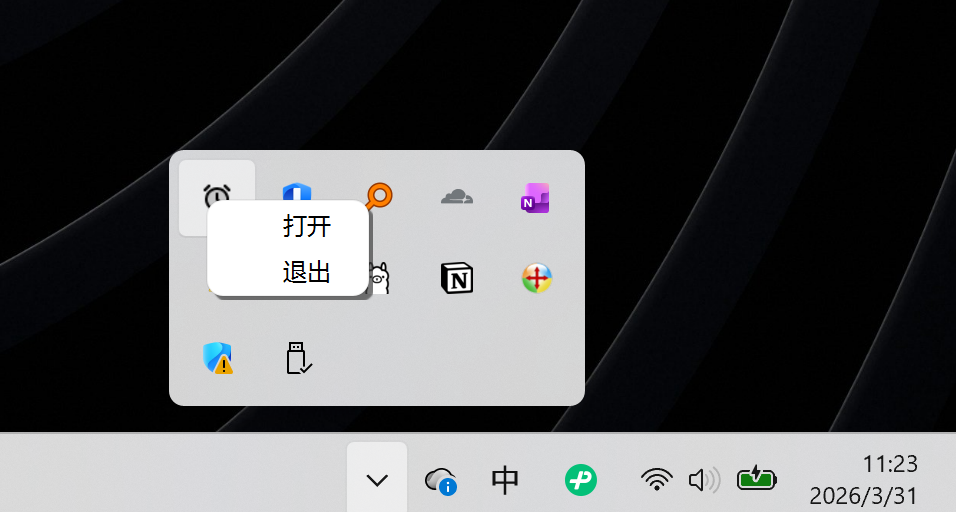
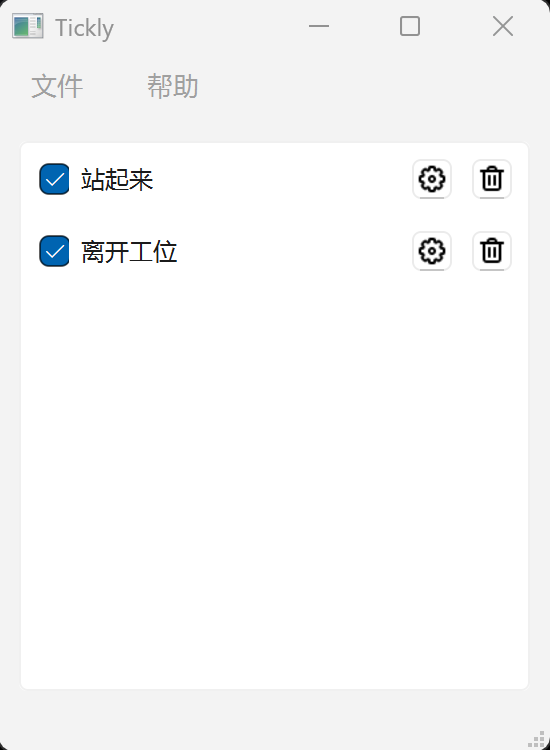
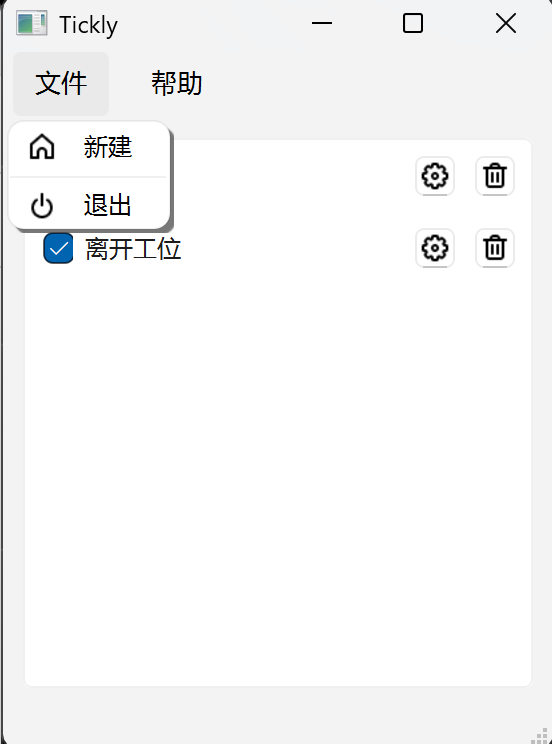
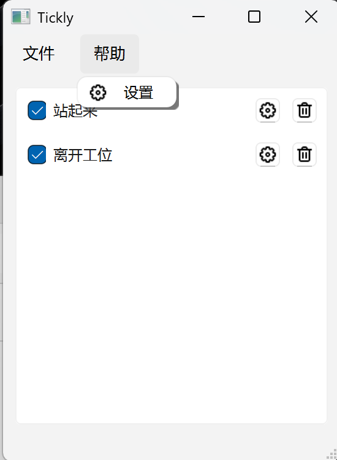
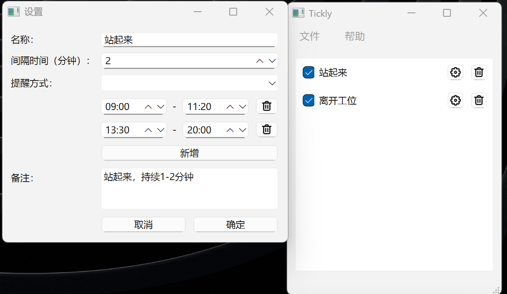

# 项目名称（Tickly）

一个基于 Qt 开发的可视化高频率提醒工具。

---

## 项目简介

本项目用于提醒当日行为，比如说长期办公室，久坐。提醒自己该站起来活动、喝水等等行为。

---

## 功能特性

- 活动增删改  
- 顺序调整  
- 自启动
- 本地配置持久化（JSON）

---

## 初试运行界面：自动默认隐藏任务栏

## 点击【打开】后的界面

## 点击【文件】，选择【新建】，添加新的活动

## 点击【帮助】后，选择【设置】，能够设置是否自启动

## 点击子活动【设置】，详细设置界面

